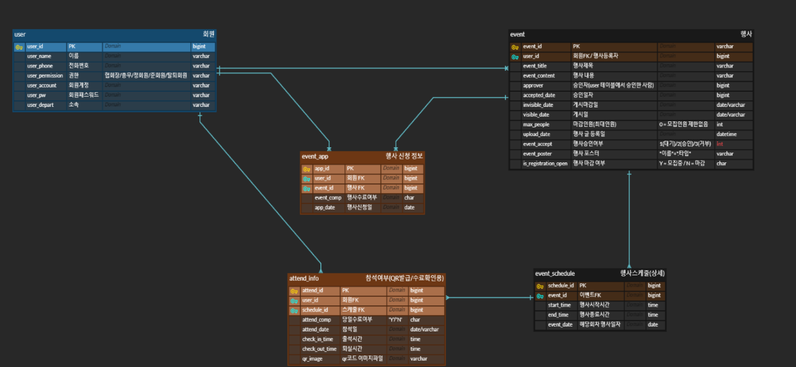
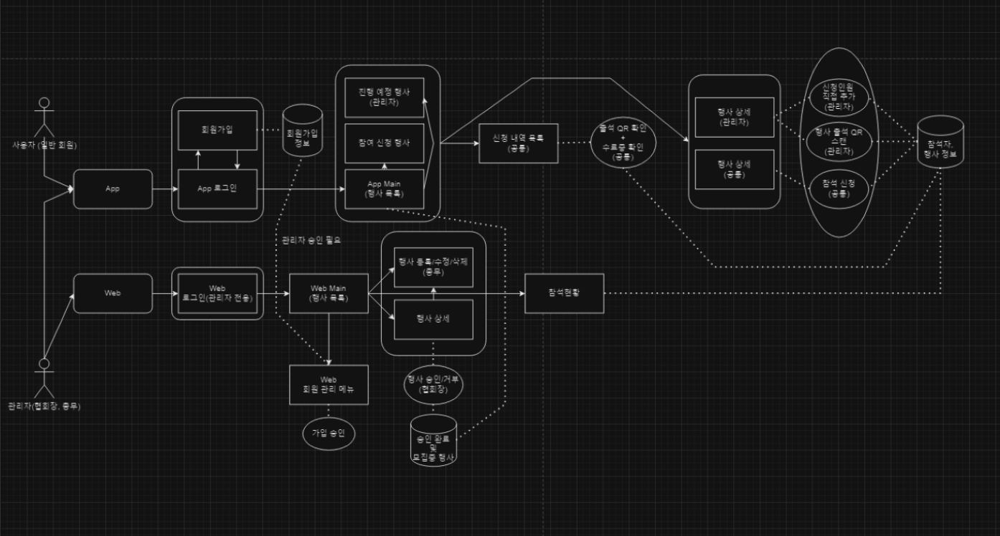

# QR Event Check Manager

# 프로젝트
> 개발기간 : 2024.10.02 ~ 2024.10.19

# 개발인원
> 5인

# 담당역할
> 팀장 
팀 기초 개발환경 세팅 및 배포 
ERD 기초설계 
React Web 연동 Back-End 구축  
React Front-End 참석자 관리 및 각종 검색기능 제작 

# Skills
>
 
 

 

 

 

# ERD & USE-CASE

ERD

USE-CASE

Mockup

시연 영상

<a href="https://youtu.be/JRwxTt_Xggc">영상 링크</a>

# 주요기능
1. React Web
> (관리자 공통) 관리자 전용 로그인 
> (관리자 공통) 회원가입 승인 및 회원 강제 탈퇴 
> (관리자 공통) 행사 참석자 정보 확인 
> (총무) 행사 등록, 수정, 삭제, 강제 모집 마감 
> (협회장: 가칭) 행사 승인, 거부, 승인취소 

2. Android Kotlin App
> 회원가입 
> (관리자 공통) 예정된 행사 확인 
> (관리자 공통) 행사 모집인원 직접 추가 
> (관리자 공통) QR 코드 스캐너로 출석 체크 
> (회원 전체) 모집중 행사 확인 
> (회원 전체) 행사 참가 신청 및 취소 
> (회원 전체) 행사, 일자별 출석용 QR코드 발급 
> (회원 전체) 참석 신청 행사 이력 확인 
> (회원 전체) 수료한 행사 수료증 확인 